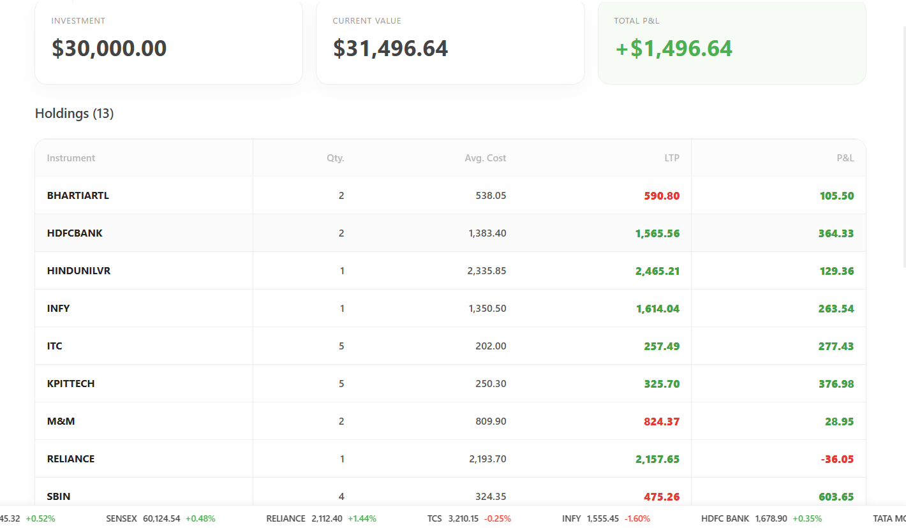

# 📈 Zerodha Trading Dashboard 

A full-stack trading dashboard inspired by Zerodha's Kite platform, featuring real-time market simulation, portfolio tracking, and interactive charts.

---

## 🚀 Overview

This application is a highly realistic simulation of a stock market brokerage dashboard. It provides a robust, interactive environment for tracking virtual equities, managing holdings, and analyzing simulated market trends without financial risk.

* **Live Market Simulation:** Real-time, mean-reverting algorithms simulate live stock price fluctuations.
* **Portfolio Management:** Tracks user holdings, calculates dynamic Profit & Loss (P&L), and manages available margin limits.
* **Interactive Data Visualization:** Integrates complex charting libraries for granular analytics and market visualization.

---

## ✨ Features

* 📊 **Dynamic Holdings Dashboard:** Real-time tracking of investments with live, color-coded P&L (Red/Green) fluctuations.
* ⚡ **Live Order Execution:** Functional Buy/Sell action windows with margin validation and simulated execution.
* 📈 **Interactive Charts:** Detailed Candlestick and Line graphs utilizing `react-chartjs-2`.
* 📋 **Custom Watchlists:** Curated list of top Indian equities (TCS, INFY, RELIANCE, ZOMATO) mapped to real corporate SVGs.
* 🌗 **Modern UI/UX:** Clean, intuitive, and responsive interface mimicking enterprise-grade financial software.
* 🔄 **Persistent Storage:** MongoDB integration for saving user holdings, positions, and order history.

---

## 📸 Screenshots

- **Dashboard Overview:**  
  

- **Holdings & Portfolio:**  
  

- **Order History:**  
  

---

## ⚙️ How It Works

1. **Initialization:** The app fetches the user's saved holdings and available margin from the Node.js backend.
2. **Market Data Simulation:** A React Context provider initializes the base stock prices and applies a bounded, mean-reverting mathematical formula to simulate live market ticks every 1.5 seconds.
3. **Data Synchronization:** The simulated global prices are cross-referenced with the user's specific holdings to calculate real-time current values and net P&L.
4. **Order Execution:** When a user buys/sells a stock, the order is validated against their available margin, and the transaction is recorded in the database.

---

## 🛠️ Tech Stack

* **Frontend:** React.js, Material-UI (MUI)
* **Charting:** Chart.js, react-chartjs-2
* **Backend:** Node.js, Express.js
* **Database:** MongoDB (Mongoose)
* **Routing:** React Router DOM

---

## 📁 Project Structure

```text
zerodha-trading-app/
├── backend/
│   ├── index.js          # Express server & API routes
│   ├── model/            # Mongoose schemas (Holdings, Orders, etc.)
│   ├── schemas/          # Database structural definitions
│   └── seed.js           # Script to initialize MongoDB database
├── dashboard/
│   ├── public/           # Static assets
│   └── src/
│       ├── components/   # React components (WatchList, Holdings, Summary...)
│       ├── data/         # Data references
│       ├── index.css     # Global styles
│       └── index.js      # React DOM entry point
└── README.md
```

---

## 🔒 Security & Environment

Ensure you have a `.env` file in the `backend` directory containing your `MONGO_URL` to connect to your local or cloud MongoDB cluster. Do not commit `.env` files to version control.

---

## 🧪 Use Cases

* **Financial Education:** Learning how stock markets and brokerages operate.
* **Paper Trading:** Practicing trading strategies without risking real money.
* **React Architecture:** Serving as a complex template for managing global states, rapid re-renders, and full-stack integration.
